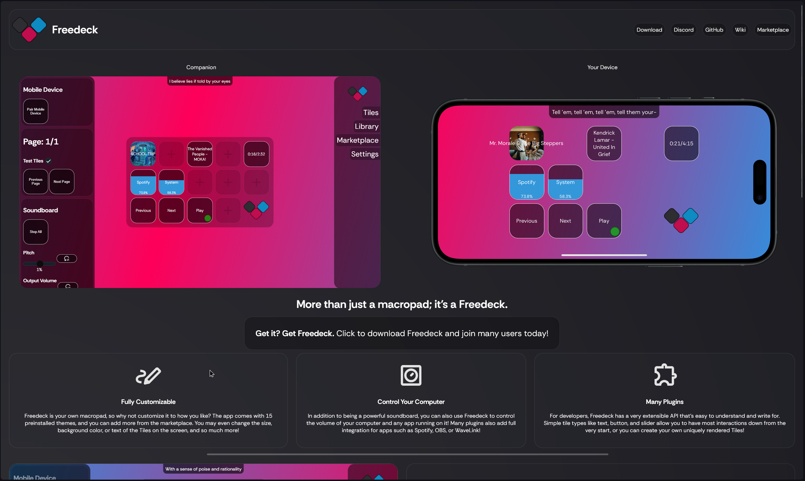

# site



This is the source code and hopefully the final branch/iteration of the site. Using SvelteKit.

## Developing

Once you've created a project and installed dependencies with `npm install` (or `pnpm install` or `yarn`), start a development server:

```bash
npm run dev
```

## Building

To create a production version of the site:

```bash
npm run build
```

> Note: I just upload the build output to freedeck.app  
> This will be automated at some point
